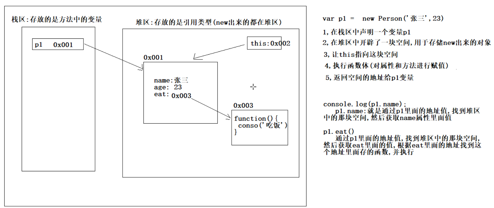

#### 昨日回顾

```
循环的应用场景
	循环次数确定,建议使用for循环  
	循环次数不确定,建议使用while循环(死循环一般用while书写)
循环的两个关键字
	continue
		跳过当前循环,继续下一次循环
	break
		终止当前循环
数组
	概念
		容器,方便管理数据
	定义
		var arr = [1,2,3]
	增
		arr[新索引] = 值
	删
		delete arr[索引]
	改
		arr[索引] = 新值
	查
		arr[索引]
		arr.length
	操作
		遍历
		求和
		求平均值
		求最大值和最小值
		找元素在数组中的索引
	二维数组
		数组的数组,里面的每一个元素都是一维数组
		arr[i] 获取的是里面的一维数组
		arr[i][j] 获取的是里面一维数组的元素
		
函数
	概念
		封装了一段具有特定功能的代码块,方便我们重复使用
	使用
		先定义在调用
	格式
		function 函数名(参数列表){
			函数体
			return 返回值
		}
		调用: 通过函数名调用  有参数就给,有返回值就接
	参数
		一个媒介,调用者可以通过它将要操作的数据传递到函数的内部进行操作
	返回值
		通用者可以通过它拿到函数执行的结果,进行下一步操作
	函数分类
		命名函数
		匿名函数
	函数的注意事项
		1,如果函数没有显示的调用return关键字返回数组,函数就没有返回值
		2,函数名其实代表整个函数
		3,如果传递的实参小于形参的个数,没有被赋值的形参的值就是undefined
	return关键字
		还可以用于结束函数
```

#### 面向对象

```
面向对象和面向过程
	面向过程:完成一件事,需要多少个步骤(重点关注的是步骤)
	面向对象:完成一件事,需要多少个对象(重点关注的是对象)
	
面向对象的思想
	就是找对象,找不同的对象,找合适的对象,帮我去做我要做的事情
	
类的概念
	对显示生活中具有相同属性和行为的事物的统称(抽象的,可以看做是模板)
	
对象的概念
	现实生活中的一个具体存在(具体的,通过模板创建出来的真实个体)
	
类和对象的关系
	类就相当于是模板,对象就是根据这个模板创建出来的一个个真实存在的个体
	类中有什么,对象中就有什么,不会多也不会少(汽车图纸和汽车)

类和对象的意义
	其实就是通过代码来描述现实生活中的事物,进行编程(编程就是源于生活)
	
类的定义
	function 类名(参数1,参数2){
		//给属性赋值
		this.属性1 = 参数1
		this.属性2 = 参数2
		
		//定义方法
		this.方法名 = function(){
			方法体
		}
	}
	
对象的创建
	var 对象名 = new 类名(实际参数1,实际参数2)
	
调用属性和方法
	对象名.属性名
	对象名.方法名
	
字面量方式创建对象
	{} 空的对象
	{属性名:属性值,方法名:匿名函数}  带有属性和方法的对象
```



#### Math对象

```
概念
	算术相关的对象,可以执行常见的算数任务。
特点
	没有构造函数 Math(),直接使用类名调用(更快捷)
属性
	PI	返回圆周率（约等于3.14159）。
方法
	max()
	min()
	abs()
	ceil()
	floor()
	round()
随机数
	找规律 生成min-max之间的随机整数
    //Math.floor(Math.random()*(max-min+1))+min
```


#### Date对象

```
概念
	用于处理日期和时间的类
创建
	new Date()
	new Date(年,月,日)
	new Date(日期类型的字符串)
获取年月日
	getFullYear()
	getMonth()
	getDate()
	getDay()
获取时分秒
	getHours()
	getMinutes()
	getSeconds()
获取毫秒值
	getTime()
	valueOf()
```


#### Number对象

```
属性
	Number.NaN	非数字
    Number.MAX_VALUE	最大值
    Number.MIN_VALUE	最小值
方法
	parseFloat()	将字符串转换成浮点数，
    parseInt()	将字符串转换成整型数字
    Number.isInteger()	判断传递的参数是否为整数。
    isNaN()	判断传递的参数是否为 isNaN()。
    toFixed()	返回指定小数位数的表示形式。
```

