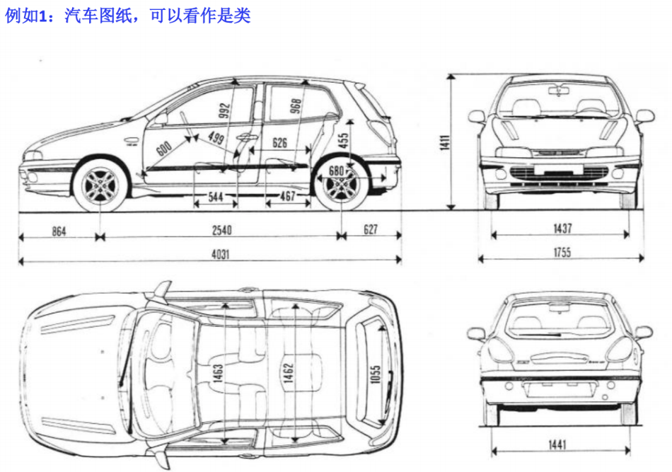
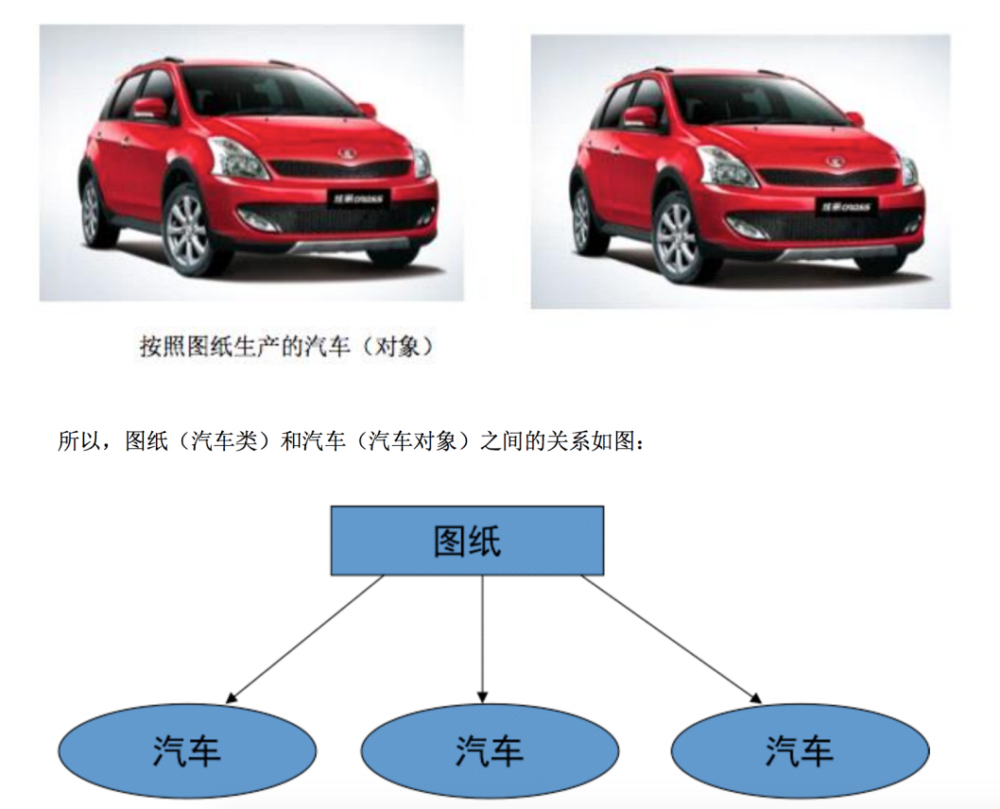
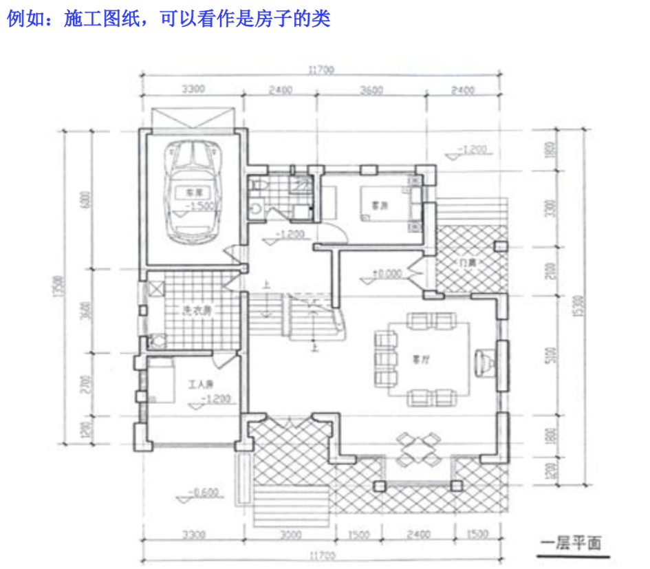
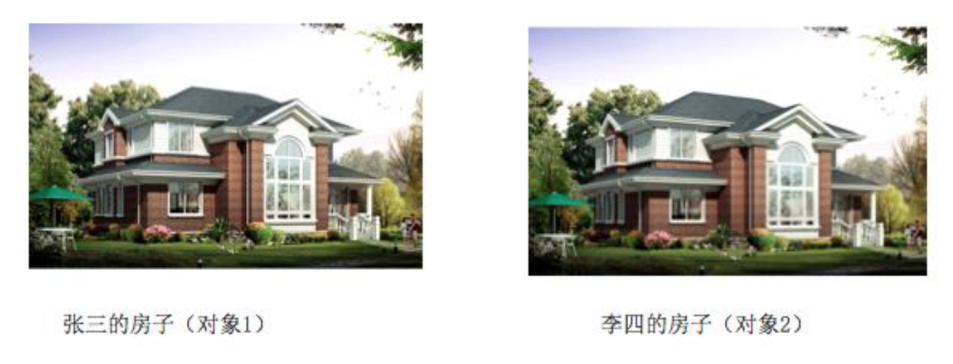
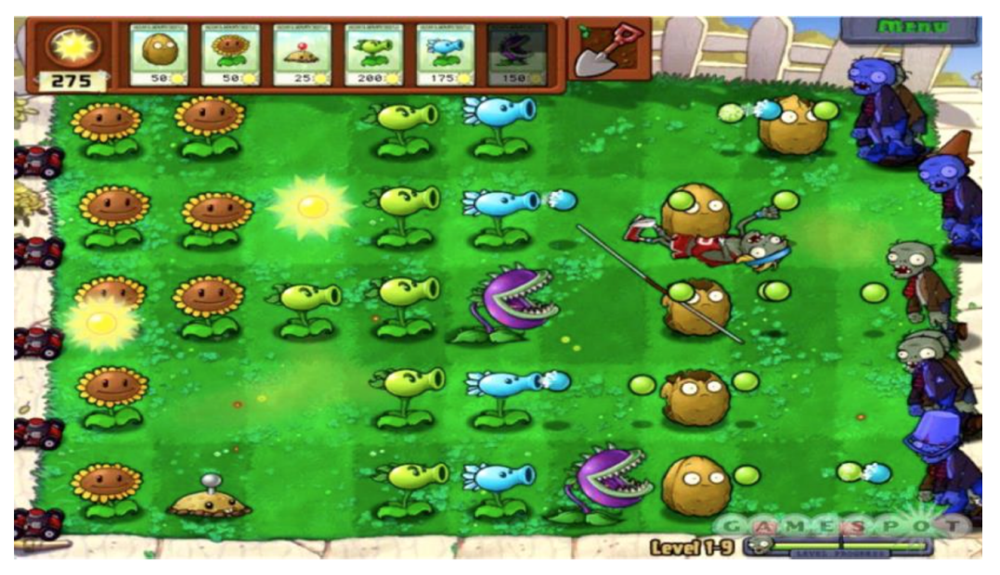

面向对象专题

#### 面向对象学习预警 

1)面向过程学习转向面向对象学习,会感觉晕晕乎乎的  

2)咱们前两节内容主要是以转换思路为主,内容不太复杂  

3)知识点会感觉到散,是因为我们现在都是为后面做案例、项目打基础。

所以,一定要告诉你,你可以的!

#### 面向对象基本概念

什么是面向对象编程?有人这么理解

我们先来说下,面向过程 和 面向对象 区别

思考1: 如何将大象装到冰箱里	

思考2: 如何完成洗衣服这件事

总结

​	面向过程

​			完成一件事,需要多少个步骤(重点关注的是步骤)

​	面向对象

​			完成一件事,需要多少个对象(重点是在于找对象)

面向对象的特点：
	1) 对象是客观存在的事物，都可以看做对象(电脑、手机、人....)
		万物皆对象
	2) 把复杂的问题简单化
	3) 把我们从执行者，变为指挥者

解决同1个问题的两种思路.
	1,面向过程
		解决这个问题的每1个步骤,都是我自己亲自去实现. 
	2,面向对象
		自己不要去亲自做,而是找1个专门做这个事情的人来帮我做.
	
代码世界中的面向过程与面向对象.
    面向过程
    	要实现1个需求.实现这个需求的每1个步骤,都是由我自己写代码1步1步的来实现的. 
	面向对象
		实现1个需求,不是自己写代码1步1步的去实现,而是找1个专门做这个事情的人来帮我们去做.

#### 类和对象的关系

什么是类?
	物以类聚,人以群分.
	之所以,要将它们分为1类.是因为组成类事物的每1个个体,都具有相同的属性和行为.

类是对1群具有相同属性和行为的事物的1个统称.
	特点:抽象的.不能直接使用.
	学生类(Student)
	人类  男人 女人
	电脑类(computer)

什么是对象?
	对象是现实生活中的具体存在.(具体到某1个才是对象.)
	特点:看得见,摸的着,拿过来就可以用
	我现在上课用的华硕笔记本

类与对象之间的关系.
	1). 类是来干啥的?
		用来描述1群具有相同属性和行为的事物的.

   2). 对象是1类事物中的1个具体存在.

  3). 类是模板,对象是根据这个类模板创建出来的.
	类模板中有什么,对象中就有什么.不会多也不会少.

  4). 类是制造月饼的模子,模子不能吃,所以类是不能用的.
	对象是根据这个模子制造出来的月饼.模子上有什么,月饼上就有什么,不会多也不会少.
	月饼可以吃,所以对象可以用. 
	所以,类模板中有什么,根据这个类模板创建出来的对象中就有什么不会多也不会少

总结：类是对象的模板，同一个模板(类)，可以创造出很多个对象。

#### 如何设计一个类

1). 类是干嘛的?  
	用来描述1群具有相同属性和行为的事物的.

2). 设计类的三要素.

​	这类事物的名称.
​	这类事物具有的共同的属性(特征). 这类事物他们都拥有什么?
​	这类事物具有的共同的行为. 这类事物都具备什么样的功能.

​	电脑类:
​		类名:电脑
​		属性:颜色 型号 尺寸
​		行为:开机 关机 看视频 打游戏

​	人类:
​		类名:人
​		属性:姓名 年龄 身高 体重
​		行为:吃饭 睡觉 思考

#### 看图找类

#### 

对于程序员来说这就是两个对象!

这是一则与面向对象相关的吊炸天的面试题......

面试官:知道什么叫类么?
应聘者:我这人实在,工作努力,不知道什么叫累。

面试官:知道什么是接口吗?
应聘者:我这个人工作认真。从来不找借口偷懒。

面试官:知道什么是继承么?
应聘者:我是孤儿没什么可以继承的。

面试官:知道什么叫对象么?
面试官:知道,不过我工作努力,上进心强,暂时还没有打算找对象。