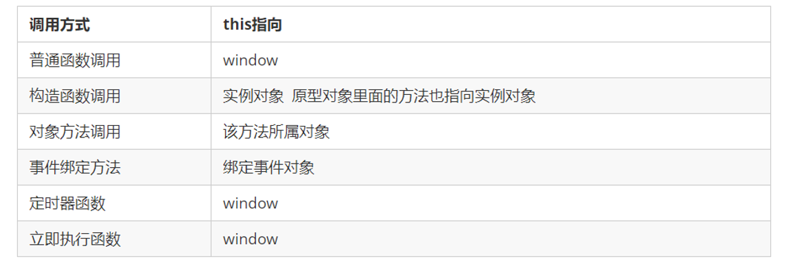

## 1 - 预编译概念

### 1) 什么是预编译

首先, 我们要知道Javascript是解释性语言

- 解释性: 逐行解析, 逐行执行

那么, 什么是预编译呢?

在Javascript真正被解析之前, js解析引擎会首先把整个文件进行**预处理**, 以消除一些歧义. 这个预处理的过程就被称为**预编译**

> 示例

```js
console.log(a)
var a = 123
console.log(a)
function a() {
  console.log(a)
}
a()
```

这是一段奇怪的代码, 大家可以先思考一下, 三个`console.log`分别会打印出什么

如果要完全理解, 我们就需要深入的分析`js引擎`到底是如何工作的!!!

### 2) 全局对象GO

> 全局对象

全局对象(Global Object): 

- 在浏览器环境中, `js引擎`会整合所有的`<script>`标签中的内容, 产生`window对象`, 这个window对象就是全局对象
- 在node环境中, 会产生`global对象`

#### 全局变量

在`<script>`标签中声明的变量为`全局变量`, 全局变量会作为`window`对象的属性存在!!

> 示例

```js
var a = 100
console.log(a)
console.log(window.a)
```

这里打印a实际上相当于打印`window`对象的a属性

> 演示


> 扩展

啥叫整合?

> 示例

```html
<script>
  var a = 100
  console.log(a)
  console.log(window.a)
</script>
<script>
  // 在这里能访问到a吗???
  console.log(a)
</script>
```

- 可以, 因为`js引擎`会把所有的`<script>`标签整合到一起, 生成一个`window`对象

#### 全局函数

在`<script>`标签中声明的函数为`全局函数`, 全局函数会作为`window`对象的方法存在!!

> 示例

```js
function a() {
  console.log('111')
}
console.log(window.a)
```

> 演示


那么问题来了, 当同时定义变量a和函数a时, 会发生什么呢?

就像我们看到的奇怪代码里一样, 而预编译就是为了处理类似的这些冲突

### 3) 活动对象AO

> 活动对象

活动对象(Activation Object): 也叫激活对象

- 在函数被调用时产生, 用来保存当前函数内部的执行环境(Execution Context), 也叫执行期上下文
- 在函数调用结束时销毁

#### 局部变量

在函数内部声明的变量叫**局部变量**, 局部变量做为**AO对象**的属性存在

> 示例

```js
function a() {
  var i = 0
  console.log(i)
}
a()
```

> 演示


> 如何理解局部

在`函数a`的外部, 不能访问`变量i`, `变量i`只在`函数a`的范围内才能使用. 其实, 这也就是作用域的由来, skr~

- 如果不执行函数, 不会产生`AO对象`, 就不会存在`i属性`
- 如果执行函数, 就会产生`AO对象`, 并将`变量i`作为`AO对象`的属性
- 函数执行完后, AO对象被销毁, 也就意味着不能使用`i属性`

#### 局部函数

在函数内部声明的函数叫**局部函数**, 局部函数做为**AO对象**的方法存在

> 示例

```js
function a() {
  function b() {
    console.log(222)
  }
  b()
}
a()
```

> 演示


## 2 - 全局预编译

### 1) 流程

1. 查找变量声明, 作为GO对象的属性名, 值为undefined
2. 查找函数声明, 作为GO对象的属性名, 值为function

> 变量声明

通过`var`关键字声明变量

```js
var a // 变量声明
var a = 111 // 变量声明+变量赋值
```

> 函数声明

通过`function`关键字声明函数

```js
function a () {} // 函数声明
var a = function () {} // 函数表达式, 不是函数声明
```

> 示例

```js
console.log(a)
var a = 100
console.log(a)
function a() {
  console.log(111)
}
console.log(a)
```

> 演示


### 2) 结论

如果存在同名的变量和函数, 函数的优先级高

## 3 - 函数预编译

### 1) 流程

1. 在函数被调用时, 为当前函数产生`AO对象`
2. 查找形参和变量声明作为`AO对象`的属性名, 值为undefined
3. 使用实参的值改变形参的值
4. 查找函数声明, 作为`AO对象`的属性名, 值为function

### 2) 示例

> 示例一

```js
function a(test) {
  var i = 0
  function b() {
    console.log(222)
  }
  b()
}
a(1)
```

> 演示


在`函数a`的AO对象中, 存在三个属性

- test: 形参, 值为1
- i: 局部变量, 值为0
- b: 局部函数

> 示例二

```js
function a(test) {
  console.log(b)
  var b = 0
  console.log(b)
  function b() {
    console.log(222)
  }
}
a(1)
```

> 演示


当局部变量与局部函数同名时, 函数的优先级高

> 示例三

```js
function a(b, c) {
  console.log(b)
  var b = 0
  console.log(b)
  function b() {
    console.log(222)
  }
  console.log(c)
}
a(1)
```

> 演示


> 示例四

```js
function a(i) {
  var i
  console.log(i)
}
a(1)
```

### 3) 结论

只要声明了局部函数, 函数的优先级最高

没有声明局部函数, 实参的优先级高

整体来说: 局部函数 > 实参 > 形参和局部变量

## 4 - 作用域与作用域链

### 4.1 作用域概念及分类

#### 概述

```
通常来说，一段程序代码中所用到的名字并不总是有效和可用的，而限定这个名字的可用性的代码范围就是这个名字的作用域。作用域的使用提高了程序逻辑的局部性，增强了程序的可靠性，减少了名字冲突。

JavaScript（es6前）中的作用域有两种：
```

- 全局作用域
- 局部作用域（函数作用域）	

#### 分类

##### 全局作用域

	作用于所有代码执行的环境(整个 script 标签内部)或者一个独立的 js 文件。

##### 局部作用域

	作用于函数内的代码环境，就是局部作用域。 因为跟函数有关系，所以也称为函数作用域。

##### 块级作用域

- 块作用域由 { } 包括。

- 在其他编程语言中（如 java、c#等），在 if 语句、循环语句中创建的变量，仅仅只能在本 if 语句、本循环语句中使用，如下面的Java代码：	

  java有块级作用域：

  ```java
  if(true){
    int num = 123;
    system.out.print(num);  // 123
  }
  system.out.print(num);    // 报错
  ```

  以上java代码会报错，是因为代码中 { } 即一块作用域，其中声明的变量 num，在 “{ }” 之外不能使用；

  而与之类似的JavaScript代码，则不会报错：


  Js中没有块级作用域（在ES6之前）

  ```js
if(true){
  var num = 123;
  console.log(123); //123
}
console.log(123);   //123
  ```

### 4.2 作用域链概念及机制

	只要是代码都一个作用域中，写在函数内部的局部作用域，未写在任何函数内部即在全局作用域中；如果函数中还有函数，那么在这个作用域中就又可以诞生一个作用域；根据在**[内部函数可以访问外部函数变量]**的这种机制，用链式查找决定哪些数据能被内部函数访问，就称作作用域链

#### 案例分析1

```
function f1() {
    var num = 123;
    function f2() {
        console.log( num );
    }
    f2();
}
var num = 456;
f1();
```

#### 案例分析2

作用域链：采取就近原则的方式来查找变量最终的值。

```js
var a = 1;
function fn1() {
    var a = 2;
    var b = '22';
    fn2();
    function fn2() {
        var a = 3;
        fn3();
        function fn3() {
            var a = 4;
            console.log(a); //a的值 ?
            console.log(b); //b的值 ?
        }
    }
}
fn1();
```

### 4.3 作用域本质分析

#### 1) 域

> 域: 范围, 区域

在js中, 作用域分为**全局作用域**和**局部作用域**

- 全局作用域: 由`<script>`标签产生的区域, 从计算机的角度可以理解为window对象
- 局部作用域: 由函数产生的区域, 从计算机的角度可以理解为该函数的AO对象

#### 2) 作用域链

在js中, 函数存在一个隐式属性[[scopes]], 这个属性用来保存当前函数在执行时的环境(上下文), 由于在数据结构上是链式的, 也被称为作用域链. 我们可以把它理解成一个**数组**

> 函数类型存在[[scopes]]属性

```js
function a() {}

console.dir(a) // 打印内部结构
```

输出


[[scopes]]属性在函数声明时产生, 在函数被调用时更新

[[scopes]]属性记录当前函数的执行环境

在函数被调用时, 将该函数的AO对象压入到[[scopes]]中

> 示例

```js
function a() {
  console.dir(a)
  function b() {
    console.dir(b)
    function c() {
      console.dir(c)
    }
    c()
  }
  b()
}
a()
```

> 演示


[[scopes]]属性是一个数组的形式

0: 是函数b的AO对象

1: 是GO对象


#### 3 作用

作用域链有什么作用呢?

<font color="red">在访问变量或者函数时, 会在作用域链上依次查找</font>, 最直观的表现是: 

- 内部函数可以使用外部函数声明的变量

> 示例

```js
function a() {
  var aa = 111
  function b() {
    console.log(aa)
  }
  b()
}
a()
```

- 在函数a中声明定义了变量aa
- 在函数b中没有声明, 却可以使用

> 思考

如果在函数b中, 也定义同名变量aa会怎样

> 示例

```js
function a() {
  var aa = 111
  function b() {
    var aa = 222
    console.log(aa)
  }
  b()
}
a()
```

第一个问题: 函数a和函数b里的变量aa是不是同一个变量?

第二个问题: 函数b里打印的aa是用的谁?

> 结论

内部函数可以使用外部函数的变量

外部函数不能使用内部函数的变量

## 5 - 原型和this指向

### 5.1对象的三种创建方式--复习

1. 字面量方式

   ```js
   var obj = {};
   ```

2. new关键字

   ```js
   var obj = new Object();
   ```

3. 构造函数方式

   ```js
   function Person(name,age){
     this.name = name;
     this.age = age;
   }
   var obj = new Person('zs',12);
   ```

### 5.2静态成员和实例成员

#### 5.2.1实例成员

实例成员就是构造函数内部通过this添加的成员 如下列代码中uname age sing 就是实例成员,实例成员只能通过实例化的对象来访问

```js
 function Star(uname, age) {
     this.uname = uname;
     this.age = age;
     this.sing = function() {
     console.log('我会唱歌');
    }
}
var ldh = new Star('刘德华', 18);
console.log(ldh.uname);//实例成员只能通过实例化的对象来访问
```

#### 5.2.2静态成员

静态成员 在构造函数本身上添加的成员  如下列代码中 sex 就是静态成员,静态成员只能通过构造函数来访问

```js
 function Star(uname, age) {
     this.uname = uname;
     this.age = age;
     this.sing = function() {
     console.log('我会唱歌');
    }
}
Star.sex = '男';
var ldh = new Star('刘德华', 18);
console.log(Star.sex);//静态成员只能通过构造函数来访问
```

### 5.3构造函数的问题

构造函数方法很好用，但是存在浪费内存的问题。


### 5.4构造函数原型prototype

构造函数通过原型分配的函数是所有对象所共享的。

JavaScript 规定，每一个构造函数都有一个prototype 属性，指向另一个对象。注意这个prototype就是一个对象，这个对象的所有属性和方法，都会被构造函数所拥有。

我们可以把那些不变的方法，直接定义在 prototype 对象上，这样所有对象的实例就可以共享这些方法。

```js
function Star(uname, age) {
    this.uname = uname;
    this.age = age;
}
Star.prototype.sing = function() {
	console.log('我会唱歌');
}
var ldh = new Star('刘德华', 18);
var zxy = new Star('张学友', 19);
ldh.sing();//我会唱歌
zxy.sing();//我会唱歌
```


### 5.5对象原型

```html
对象都会有一个属性 __proto__ 指向构造函数的 prototype 原型对象，之所以我们对象可以使用构造函数 prototype 原型对象的属性和方法，就是因为对象有 __proto__ 原型的存在。
__proto__对象原型和原型对象 prototype 是等价的
__proto__对象原型的意义就在于为对象的查找机制提供一个方向，或者说一条路线，但是它是一个非标准属性，因此实际开发中，不可以使用这个属性，它只是内部指向原型对象 prototype
```


### 5.6constructor构造函数

```html
对象原型（ __proto__）和构造函数（prototype）原型对象里面都有一个属性 constructor 属性 ，constructor 我们称为构造函数，因为它指回构造函数本身。
constructor 主要用于记录该对象引用于哪个构造函数，它可以让原型对象重新指向原来的构造函数。
			一般情况下，对象的方法都在构造函数的原型对象中设置。
```

### 5.7原型链

​	每一个实例对象又有一个__proto__属性，指向的构造函数的原型对象，构造函数的原型对象也是一个对象，也有__proto__属性，这样一层一层往上找就形成了原型链。


### 5.8构造函数实例和原型对象三角关系

```js
1.构造函数的prototype属性指向了构造函数原型对象
2.实例对象是由构造函数创建的,实例对象的__proto__属性指向了构造函数的原型对象
3.构造函数的原型对象的constructor属性指向了构造函数,实例对象的原型的constructor属性也指向了构造函数
```


### 5.9原型链和成员的查找机制

任何对象都有原型对象,也就是prototype属性,任何原型对象也是一个对象,该对象就有__proto__属性,这样一层一层往上找,就形成了一条链,我们称此为原型链;

```html
当访问一个对象的属性（包括方法）时，首先查找这个对象自身有没有该属性。
如果没有就查找它的原型（也就是 __proto__指向的 prototype 原型对象）。
如果还没有就查找原型对象的原型（Object的原型对象）。
依此类推一直找到 Object 为止（null）。
__proto__对象原型的意义就在于为对象成员查找机制提供一个方向，或者说一条路线。
```

### 5.10原型对象中this指向

构造函数中的this和原型对象的this,都指向我们new出来的实例对象

```js
function Star(uname, age) {
    this.uname = uname;
    this.age = age;
}
var that;
Star.prototype.sing = function() {
    console.log('我会唱歌');
    that = this;
}
var ldh = new Star('刘德华', 18);
// 1. 在构造函数中,里面this指向的是对象实例 ldh
console.log(that === ldh);//true
// 2.原型对象函数里面的this 指向的是 实例对象 ldh
```


### 5.11通过原型为数组扩展内置方法

```js
 Array.prototype.sum = function() {
   var sum = 0;
   for (var i = 0; i < this.length; i++) {
   sum += this[i];
   }
   return sum;
 };
 //此时数组对象中已经存在sum()方法了  可以始终 数组.sum()进行数据的求
```

## 6 - 函数进阶

### 6.1函数的定义方式

1. 方式1 函数声明方式 function 关键字 (命名函数)

   ```js
   function fn(){}
   ```

2. 方式2 函数表达式(匿名函数)

   ```js
   var fn = function(){}
   ```

3. 方式3 new Function() 

   ```js
   var f = new Function('a', 'b', 'console.log(a + b)');
   f(1, 2);
   
   var fn = new Function('参数1','参数2'..., '函数体')
   注意
   /*Function 里面参数都必须是字符串格式
   第三种方式执行效率低，也不方便书写，因此较少使用
   所有函数都是 Function 的实例(对象)  
   函数也属于对象
   */
   ```

### 6.2函数的调用

```js
/* 1. 普通函数 */
function fn() {
	console.log('人生的巅峰');
}
 fn(); 
/* 2. 对象的方法 */
var o = {
  sayHi: function() {
  	console.log('人生的巅峰');
  }
}
o.sayHi();
/* 3. 构造函数*/
function Star() {};
new Star();
/* 4. 绑定事件函数*/
 btn.onclick = function() {};   // 点击了按钮就可以调用这个函数
/* 5. 定时器函数*/
setInterval(function() {}, 1000);  这个函数是定时器自动1秒钟调用一次
/* 6. 立即执行函数(自调用函数)*/
(function() {
	console.log('人生的巅峰');
})();
```

### 6.3函数内部的this指向

这些 this 的指向，是当我们调用函数的时候确定的。调用方式的不同决定了this 的指向不同

一般指向我们的调用者.



### 6.4改变函数内部 this 指向

call()方法调用一个对象。简单理解为调用函数的方式，但是它可以改变函数的 this 指向

```js
var o = {
	name: 'andy'
}
 function fn(a, b) {
      console.log(this);
      console.log(a+b)
};
fn(1,2)// 此时的this指向的是window 运行结果为3
fn.call(o,1,2)//此时的this指向的是对象o,参数使用逗号隔开,运行结果为3
```

以上代码运行结果为:


### 6.5.高阶函数

高阶函数是对其他函数进行操作的函数，它接收函数作为参数或将函数作为返回值输出。


此时fn 就是一个高阶函数

函数也是一种数据类型，同样可以作为参数，传递给另外一个参数使用。最典型的就是作为回调函数。

同理函数也可以作为返回值传递回来

## 7 - 闭包

### 7.1变量的作用域复习

变量根据作用域的不同分为两种：全局变量和局部变量。

1. 函数内部可以使用全局变量。
2. 函数外部不可以使用局部变量。
3. 当函数执行完毕，本作用域内的局部变量会销毁。

### 7.2什么是闭包

闭包（closure）指有权访问另一个函数作用域中变量的函数。简单理解就是 ，一个作用域可以访问另外一个函数内部的局部变量。 


### 7.3闭包的作用

作用：延伸变量的作用范围。

```js
 function fn() {
   var num = 10;
   function fun() {
       console.log(num);
 	}
    return fun;
 }
var f = fn();
f();
```

### 7.4闭包的案例

闭包应用-3秒钟之后,打印所有li元素的内容

```js
 for (var i = 0; i < lis.length; i++) {
   (function(i) {
     setTimeout(function() {
     console.log(lis[i].innerHTML);
     }, 3000)
   })(i);
}
```

## 8 - let和const

### 8.1 let

ES6中新增了用于声明变量的关键字

#### let声明的变量只在所处于的块级有效

```javascript
 if (true) { 
     let a = 10;
 }
console.log(a) // a is not defined
```

**注意：**使用let关键字声明的变量才具有块级作用域，使用var声明的变量不具备块级作用域特性。

#### 不存在变量提升

```javascript
console.log(a); // a is not defined 
let a = 20;
```

#### 暂时性死区

利用let声明的变量会绑定在这个块级作用域，不会受外界的影响

```javascript
 var tmp = 123;
 if (true) { 
     tmp = 'abc';
     let tmp; 
 } 
```

#### 经典面试题

```javascript
 var arr = [];
 for (var i = 0; i < 2; i++) {
     arr[i] = function () {
         console.log(i); 
     }
 }
 arr[0]();
 arr[1]();

```


**经典面试题图解：**此题的关键点在于变量i是全局的，函数执行时输出的都是全局作用域下的i值。

```javascript
 let arr = [];
 for (let i = 0; i < 2; i++) {
     arr[i] = function () {
         console.log(i); 
     }
 }
 arr[0]();
 arr[1]();

```


**经典面试题图解：**此题的关键点在于每次循环都会产生一个块级作用域，每个块级作用域中的变量都是不同的，函数执行时输出的是自己上一级（循环产生的块级作用域）作用域下的i值.

#### 小结

- let关键字就是用来声明变量的
- 使用let关键字声明的变量具有块级作用域
- 在一个大括号中 使用let关键字声明的变量才具有块级作用域 var关键字是不具备这个特点的
- 防止循环变量变成全局变量
- 使用let关键字声明的变量没有变量提升
- 使用let关键字声明的变量具有暂时性死区特性

### 8.2 const

声明常量，常量就是值（内存地址）不能变化的量

#### 具有块级作用域

```javascript
 if (true) { 
     const a = 10;
 }
console.log(a) // a is not defined
```

#### 声明常量时必须赋值

```javascript
const PI; // Missing initializer in const declaration
```

#### 常量赋值后，值不能修改

```javascript
const PI = 3.14;
PI = 100; // Assignment to constant variable.

const ary = [100, 200];
ary[0] = 'a';
ary[1] = 'b';
console.log(ary); // ['a', 'b']; 
ary = ['a', 'b']; // Assignment to constant variable.
```

#### 小结

- const声明的变量是一个常量
- 既然是常量不能重新进行赋值，如果是基本数据类型，不能更改值，如果是复杂数据类型，不能更改地址值
- 声明 const时候必须要给定值

### 8.3 let、const、var 的区别

- 使用 var 声明的变量，其作用域为该语句所在的函数内，且存在变量提升现象
- 使用 let 声明的变量，其作用域为该语句所在的代码块内，不存在变量提升
- 使用 const 声明的是常量，在后面出现的代码中不能再修改该常量的值


#### 1 Script对象与Block对象

let和const声明的变量不会挂载到GO(window)对象上, 而是做为Script对象的属性存在

> 块作用域

由`{}`形成块作用域, 会形成一个Block对象

在`{}`里通过let和const声明的变量做为Block对象的属性

> 示例

```js
let i = 1
{
  let i = 2
  console.log(i)
}
console.log(i)
```

> 演示


#### 2 不能重复声明

在同一个Script和同一个Block下, 不能重复声明, 会报语法错误

> 示例

```js
let i = 1
{
  let i = 2
  const i = 3 // 会报语法错误
  console.log(i)
}
console.log(i)
```

#### 3 声明前不能使用(TDZ)

在变量声明前是不能使用的

> 示例

```js
console.log(i) // 在script作用域下, 声明前不能使用
let i = 1
{
  let i = 2
}
```

> 示例

```js
let i = 1
{
  console.log(i) // 在block作用域下, 声明前不能使用
  let i = 2
}
```

我们通过也把这个区域叫做`暂时性死区TDZ`

#### 4 在for循环中使用let

> 示例

```js
const arr = []
for (let i = 0; i < 3; i++) {
  arr[i] = function () {
    console.log(i)
  }
}
arr[0]()
```

> 演示


看这里的作用域链

所以, 当调用`arr[0]`时, 在自己的作用域链上查找, 先找到Block作用域中i的值0

## 9 - 解构赋值

ES6中允许从数组中提取值，按照对应位置，对变量赋值，对象也可以实现解构

#### 9.1 数组解构

```javascript
 let [a, b, c] = [1, 2, 3];
 console.log(a)//1
 console.log(b)//2
 console.log(c)//3
//如果解构不成功，变量的值为undefined
```

#### 9.2 对象解构

```javascript
 let person = { name: 'zhangsan', age: 20 }; 
 let { name, age } = person;
 console.log(name); // 'zhangsan' 
 console.log(age); // 20

 let {name: myName, age: myAge} = person; // myName myAge 属于别名
 console.log(myName); // 'zhangsan' 
 console.log(myAge); // 20

```

#### 9.3 小结

- 解构赋值就是把数据结构分解，然后给变量进行赋值
- 如果结构不成功，变量跟数值个数不匹配的时候，变量的值为undefined
- 数组解构用中括号包裹，多个变量用逗号隔开，对象解构用花括号包裹，多个变量用逗号隔开
- 利用解构赋值能够让我们方便的去取对象中的属性跟方法

## 10 - 箭头函数

### 10.1语法

ES6中新增的定义函数的方式。

```javascript
() => {} //()：代表是函数； =>：必须要的符号，指向哪一个代码块；{}：函数体
const fn = () => {}//代表把一个函数赋值给fn
```

函数体中只有一句代码，且代码的执行结果就是返回值，可以省略大括号

```javascript
 function sum(num1, num2) { 
     return num1 + num2; 
 }
 //es6写法
 const sum = (num1, num2) => num1 + num2; 

```

如果形参只有一个，可以省略小括号

```javascript
 function fn (v) {
     return v;
 } 
//es6写法
 const fn = v => v;

```

箭头函数不绑定this关键字，箭头函数中的this，指向的是函数定义位置的上下文this

```javascript
const obj = { name: '张三'} 
 function fn () { 
     console.log(this);//this 指向 是obj对象
     return () => { 
         console.log(this);//this 指向 的是箭头函数定义的位置，那么这个箭头函数定义在fn里面，而这个fn指向是的obj对象，所以这个this也指向是obj对象
     } 
 } 
 const resFn = fn.call(obj); 
 resFn();

```

#### 10.2 小结

- 箭头函数中不绑定this，箭头函数中的this指向是它所定义的位置，可以简单理解成，定义箭头函数中的作用域的this指向谁，它就指向谁
- 箭头函数的优点在于解决了this执行环境所造成的一些问题。比如：解决了匿名函数this指向的问题（匿名函数的执行环境具有全局性），包括setTimeout和setInterval中使用this所造成的问题

#### 10.3 面试题

```javascript
var age = 100;

var obj = {
	age: 20,
	say: () => {
		alert(this.age)
	}
}

obj.say();//箭头函数this指向的是被声明的作用域里面，而对象没有作用域的，所以箭头函数虽然在对象中被定义，但是this指向的是全局作用域
```

## 11 promise

### 11.1 为什么需要promise

像写同步代码一样写异步代码

### 11.2 Promise的基本使用

Promise是一个构造函数, 通过new关键字实例化对象

> 语法

```js
new Promise((resolve, reject)=>{})
```

- Promise接受一个函数作为参数
- 在参数函数中接受两个参数
  - resolve: 成功函数
  - reject: 失败函数

> promise实例

promise实例有两个属性

- state: 状态
- result: 结果

### 1) promise的状态

第一种状态: pending(准备, 待解决, 进行中)

第二种状态: fulfilled(已完成, 成功)

第三种状态: rejected(已拒绝, 失败)

### 2) promise状态的改变

通过调用resolve()和reject()改变当前promise对象的状态

> 示例

```js
const p = new Promise((resolve, reject) => {
  // resolve(): 调用函数, 使当前promise对象的状态改成fulfilled
  resolve()
})
console.dir(p) // fulfilled
```

> 示例

```js
const p = new Promise((resolve, reject) => {
  // resolve(): 调用函数, 使当前promise对象的状态改成fulfilled
  // reject(): 调用函数, 使当前promise对象的状态改成rejected

  // resolve()
  reject()
})
console.dir(p)
```

- resolve(): 调用函数, 使当前promise对象的状态改成fulfilled
- reject(): 调用函数, 使当前promise对象的状态改成rejected

> promise状态的改变是一次性的, 单向不可逆

### 3) promise的结果

> 示例

```js
const p = new Promise((resolve, reject)=> {
  // 通过调用resolve, 传递参数, 改变 当前promise对象的 结果
  resolve('成功的结果')
  //reject('失败的结果')
})
console.dir(p)
```

### 11.3 Promise的方法

####  then方法

> 示例

```js
const p = new Promise((resolve, reject)=> {
  // 通过调用resolve, 传递参数, 改变 当前promise对象的 结果
  resolve('成功的结果')
  //reject('失败的结果')
})

// then方法函数
// 参数
// 1. 是一个函数
// 2. 还是一个函数
// 返回值: 是一个promise对象
p.then(()=>{
  // 当promise的状态是fulfilled时, 执行
  console.log('成功时调用')
}, () => {
  // 当promise的状态是rejected时, 执行
  console.log('失败时调用')
})
console.dir(p)
```

> 示例

```js
const p = new Promise((resolve, reject)=> {
  // 通过调用resolve, 传递参数, 改变 当前promise对象的 结果
  //resolve('123')
  reject('失败的结果')
})

// then方法函数
// 参数
// 1. 是一个函数
// 2. 还是一个函数
// 返回值: 是一个promise对象
p.then((value)=>{
  // 当promise的状态是fulfilled时, 执行
  console.log('成功时调用', value)
}, (err) => {
  // 当promise的状态是rejected时, 执行
  console.log('失败时调用', err)
})
console.dir(p)
```

- 在then方法的参数函数中, 通过形参使用promise对象的结果

> then方法返回一个新的promise实例, 状态是pending

```js
const p = new Promise((resolve, reject)=> {
  // 通过调用resolve, 传递参数, 改变 当前promise对象的 结果
  resolve('123')
  //reject('失败的结果')
})

// then方法函数
// 参数
// 1. 是一个函数
// 2. 还是一个函数
// 返回值: 是一个promise对象
const t = p.then((value)=>{
  // 当promise的状态是fulfilled时, 执行
  console.log('成功时调用', value)
}, (reason) => {
  // 当promise的状态是rejected时, 执行
  console.log('失败时调用', reason)
})
console.dir(t)
```

> promise的状态不改变, 不会执行then里的方法

```js
// 如果promise的状态不改变, then里的方法不会执行
new Promise((resolve, reject) => {

}).then((value) => {
  console.log('成功')
}, (reason) => {
  console.log('失败')
})
```

> 在then方法中, 通过return将返回的promise实例改为fulfilled状态

```js
// 如果promise的状态不改变, then里的方法不会执行
const p = new Promise((resolve, reject) => {
  resolve()
})

const t = p.then((value) => {
  console.log('成功')
  // 使用return可以将t实例的状态改成fulfilled
  return 123
}, (reason) => {
  console.log('失败')
})

t.then((value) => {
  console.log('成功2', value)
}, (reason) => {
  console.log('失败')
})
```

> 如果在then方法中, 出现代码错误, 会将返回的promise实例改为rejected状态

```js
// 如果promise的状态不改变, then里的方法不会执行
const p = new Promise((resolve, reject) => {
  resolve()
})

const t = p.then((value) => {
  console.log('成功')
  // 使用return可以将t实例的状态改成fulfilled
  //return 123

  // 如果这里的代码出错, 会将t实例的状态改成rejected
  console.log(a)

}, (reason) => {
  console.log('失败')
})

t.then((value) => {
  console.log('成功2', value)
}, (reason) => {
  console.log('失败', reason)
})
```

`
