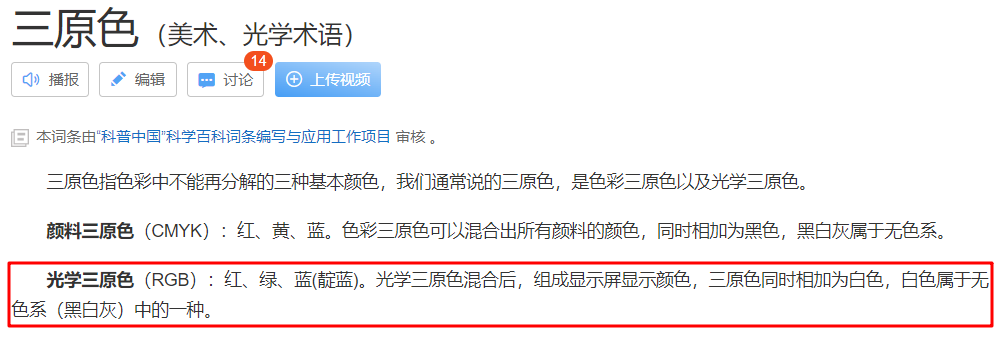
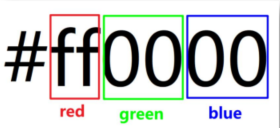

#### 颜色取值方式一

```
Ø 取值类型①：关键词
Ø 常见颜色取值：
• red：红色
• green：绿色
• blue：蓝色
• yellow：黄色
• orange：橘色
• skyblue：天蓝色
• pink：粉色
• …….
```

#### 颜色取值方式二



```
Ø 取值类型②：rgb表示法
Ø 每项取值范围：0~255
Ø 常见颜色取值：
• rgb ( 255 , 0 , 0 ) ：红色
• rgb ( 0 , 255 , 0 ) ：绿色
• rgb ( 0 , 0 , 255 ) ：蓝色
• rgb ( 0 , 0 , 0 ) ：黑色
• rgb ( 255 , 255 , 255 ) ：白色
• ……
```

#### 颜色取值方式三

```
Ø 取值类型③：rgba表示法
• 其实，比rgb表示法多个一个a，a表示透明度
Ø a的取值范围：0~1
• 1：完全不透明
• 0：完全透明
Ø 省略写法：
• rgba ( 0 , 0 , 0 , 0.5 ) 可以省略写成 rgba ( 0, 0 ,0 ,.5 )
```

#### 颜色取值方式四



```
Ø 取值类型④：十六进制表示法
Ø 取值范围：
• 两个数字为一组，每个数字的取值范围：0~9 , a , b , c , d , e , f
Ø 省略写法：
• 如果三组中，每组数字都相同，此时可以每组可以省略只写一个数字
• 正确写法：#ffaabb 改写成 #fab
Ø 常见取值：
• #fff ：白色
• #000 ：黑色
Ø 注意点
1. 类似于：#ffaabc 不能改写成 #fabc
2. 实际开发中会直接使用测量工具直接得到颜色，不需要前端自己设计颜色，直接复制粘贴即可。
```

