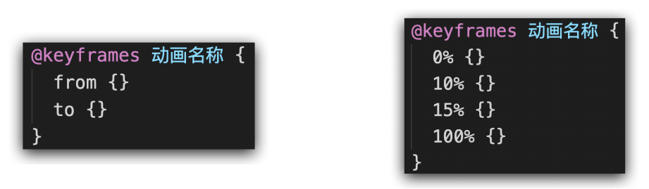
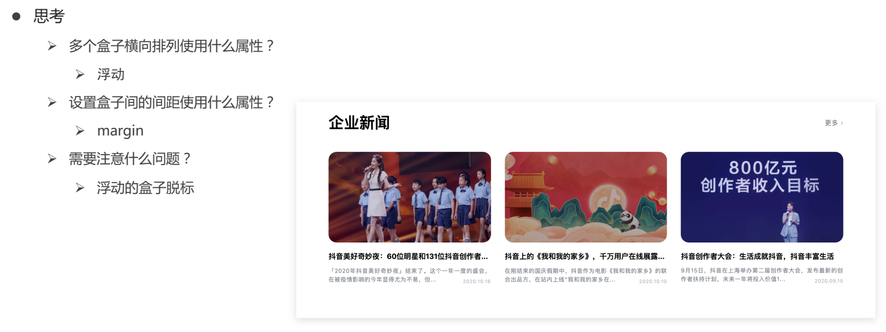

### 1.vertical-align

#### 1.1 认识基线（了解）

基线：浏览器文字类型元素排版中存在用于对齐的基线（baseline）

#### 1.2 文字对齐问题

 场景：解决行内/行内块元素垂直对齐问题
 问题：当图片和文字在一行中显示时，其实底部不是对齐的

#### 1.3 垂直对齐方式

属性名：vertical-align
属性值：

#### 1.4 vertical-align 可以解决的问

​	 1.div不设高度由img标签撑开，此时img标签下面会存在额外间隙问题

 	2.使用line-height让img标签垂直居中问题

注意点：
   • 学习浮动之后，不推荐使用行内块元素让div一行中显示，因为可能会出现垂直对齐问题
   • 推荐优先使用浮动完成效果

### 2, 其他效果

#### 2.1 溢出部分显示效果

溢出部分：指的是盒子 内容部分 所超出盒子范围的区域

场景：控制内容溢出部分的显示效果，如：显示、隐藏、滚动条……
属性名：overflow
常见属性值：

#### 2.2 元素本身隐藏

 场景：让某元素本身在屏幕中不可见。如：鼠标:hover之后元素隐藏
 常见属性：

​	visibility：hidden

​	display：none 

 区别：

​	visibility：hidden 隐藏元素本身，并且在网页中 占位置

​	display：none 隐藏元素本身，并且在网页中 不占位置

注意点：
• 开发中经常会通过 display属性完成元素的显示隐藏切换
• display：none；（隐藏）、 display：block；（显示）

### 3, 字体图标

#### 3.1 概念

字体图标

​	字体图标展示的是图标，本质是字体。

​	处理简单的、颜色单一的图片

使用字体图标技巧实现网页中简洁的图标效果

字体图标的优点：
	灵活性：灵活地修改样式，例如：尺寸、颜色等
	轻量级：体积小、渲染快、降低服务器请求次数
	兼容性：几乎兼容所有主流浏览器
	使用方便：

1. 下载字体包
2. 使用字体图标

#### 3,2使用

图标库
     Iconfont：https://www.iconfont.cn/

下载字体包：
 	登录（新浪微博） → 选择图标库 → 选择图标，加入购物车 → 购物车 → 添加至项目 → 下载至本地

使用字体图标

​	1,引入字体图标样式表

​	2.调用图标对应的类名，必须调用2个类名

​		iconfont类：基本样式，包含字体的使用等

   	 icon-xxx：图标对应的类名

### 4, CSS3新特性

#### 4.1 过渡

Ø 作用：让元素的样式慢慢的变化，常配合hover使用，增强网页交互体验
Ø 属性名：transition
Ø 常见取值：

Ø 注意点：

1. 过渡需要：默认状态 和 hover状态样式不同，才能有过渡效果
2. transition属性给需要过渡的元素本身加
3. transition属性设置在不同状态中，效果不同的
① 给默认状态设置，鼠标移入移出都有过渡效果
② 给hover状态设置，鼠标移入有过渡效果，移出没有过渡效果

#### 4.2 位移

目标

​	使用translate实现元素位移效果

语法
	transform: translate(水平移动距离, 垂直移动距离);
取值（正负均可）
	像素单位数值
	百分比（参照物为盒子自身尺寸）
	注意：X轴正向为右，Y轴正向为下

技巧
	 translate()如果只给出一个值, 表示x轴方向移动距离
	 单独设置某个方向的移动距离：translateX() & translateY()

#### 4.3 旋转

目标

​	使用rotate实现元素旋转效果

语法
	transform: rotate(角度);
	注意：角度单位是deg

技巧：取值正负均可
	取值为正, 则顺时针旋转
	取值为负, 则逆时针旋转

#### 4.4 渐变

目标：

​	使用background-image属性实现渐变背景效果

特点

​	渐变是多个颜色逐渐变化的视觉效果

​    一般用于设置盒子的背景

语法

​	background-image: linear-gradient(
​		颜色1,
​		颜色2,
​	); 

​	background-image: linear-gradient(
​		transparent,
​		rgba(0,0,0, .6)
​	);

#### 4.5 动画

概念

​	动画的本质是快速切换大量图片时在人脑中形成的具有连续性的画面

​	构成动画的最小单元：帧或动画帧

作用

​	思考：过渡可以实现什么效果？ 

​	答：实现2个状态间的变化过程

​	动画效果：实现多个状态间的变化过程，动画过程可控（重复播放、最终画面、是否暂停）

使用

​	1. 定义动画

​		

​	2,使用动画

​	

属性

​	使用animation相关属性控制动画执行过程

注意：
Ø 动画名称和动画时长必须赋值
Ø 取值不分先后顺序
Ø 如果有2个时间值，第一个时间表示动画时长，第二个时间表示延迟时间

### 5,flex布局

##### 5.1 概念

Flex布局/弹性布局：
	是一种浏览器提倡的布局模型
	布局网页更简单、灵活
	避免浮动脱标的问题

##### 5.2 作用

​	基于 Flex 精确灵活控制块级盒子的布局方式，避免浮动布局中脱离文档流现象发生。
​	 Flex布局非常适合结构化布局

##### 5.3 设置方式

​	父元素添加 display: flex，子元素可以自动的挤压或拉伸

##### 5.4 组成部分

​	弹性容器
​	弹性盒子
​	主轴
​	侧轴 / 交叉轴

##### 5.5 主轴对齐方式

​	思考：网页中，盒子之间有距离吗？

​	答：有。

​	在Flex布局模型中，调节主轴或侧轴的对齐方式来设置盒子之间的间距。

修改主轴对齐方式属性: justify-content

##### 5.6 侧轴对齐方式

修改侧轴对齐方式属性: 

​	align-items（添加到弹性容器）

​	align-self： 控制某个弹性盒子在侧轴的对齐方式（添加到弹性盒子）

##### 5.7 伸缩比

使用flex属性修改弹性盒子伸缩比

 	属性
 		flex : 值;
 	取值分类
 		数值(整数)

​	注意 : 只占用父盒子剩余尺寸

##### 5.8 主轴方向

 思考：Flex布局模型中，弹性盒子默认沿着哪个方向排列？
 答：水平方向。
 思考：如何实现内容垂直排列？

使用flex-direction改变元素排列方向

​	主轴默认是水平方向, 侧轴默认是垂直方向

​	修改主轴方向属性: flex-direction

##### 5.9 弹性盒子换行

使用flex-wrap实现弹性盒子多行排列效果

​	思考：默认情况下，多个弹性盒子如何显示？
​	弹性盒子换行显示 : flex-wrap: wrap;
​	调整行对齐方式 ：align-content
​	取值与justify-content基本相同

